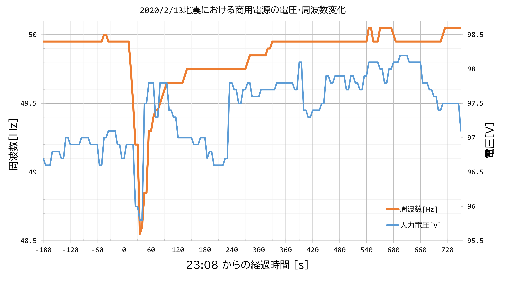

# 地震に伴う商用電源の周波数の変動
2020/2/13 23:08に発生した福島県沖を震源とするM7.3の地震に伴う、商用電源の周波数変動のデータです。

## ファイル一覧
* `DataLog.csv` : 測定データ
* `graphplot.ipynb` : グラフ作成用Jupyter IPython Notebook
* `graphplot.py` : グラフ作成用Python3スクリプト
* `graph.png` : Excelで作ったグラフ

## 測定条件
* 測定機器: UPS OMRON BN100S
* 場所: 茨城県
* データ範囲: 2021/2/13 18:00 - 2/14 06:00
* 測定間隔: 5秒毎

## 注意点
* このUPSで測定した周波数は、真値より0.05～0.1Hzほど低めに出るようです。
